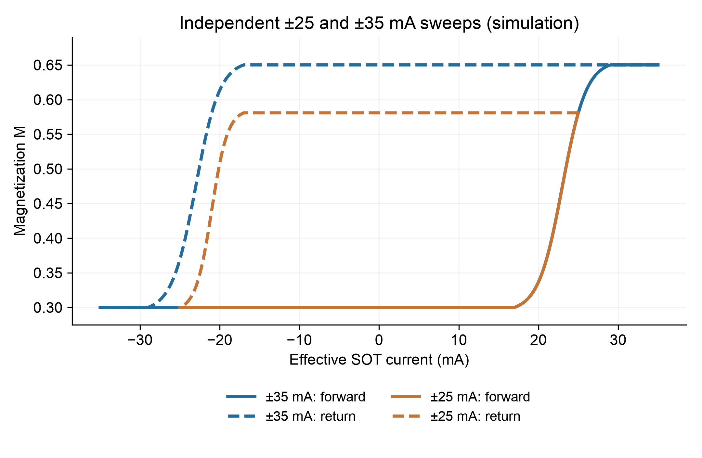

# Spintronic dendritic device

SOT behavioral models, resistor-network calculations, ngspice circuit simulations and MNIST network comparisons. All source files and example results are available directly in the folders below.

## Repository structure

```text
sot_model/                 SOT and resistor-network core, demo and tests
circuit_simulation/
  scripts/                 Three simulation stages
  templates/               Full-chain circuit template
  models/                  Sample-and-hold, comparator and op-amp models
  memory_model/            Five-port position and memory model
  results/                 Generated netlists and waveform previews
  run_all.py               Run all three stages in order
  README.md                Circuit instructions
卷积网络/                  One-epoch MNIST FC, convolution and dendritic networks
requirements.txt           SOT and circuit Python dependencies
```

## SOT and resistor-network demo

Requires Python 3.10+. From the repository root:

```bash
python3 -m pip install -r requirements.txt
cd sot_model
python3 run_demo.py
python3 -m unittest -v test_protocol.py
```

The formulation considered here is restricted to a single-reversal protocol. The demo overlays two independently initialized sweeps: −25 → +25 → −25 mA and −35 → +35 → −35 mA.



See [SOT instructions](sot_model/README.md) for usage and outputs.

## Circuit simulation

Install ngspice separately and make sure `ngspice --version` works. From the repository root, after installing the Python dependencies:

```bash
python3 circuit_simulation/run_all.py
```

This runs input generation, the complete circuit simulation, and the three-read-cycle timing simulation. Waveform previews and generated netlists are included. Raw transient CSV files are regenerated by the scripts. Results are written to `circuit_simulation/results/`; rerunning replaces generated files of the same name.

The four position sequences are 12345, 321, 345 and 12333. The circuit retains its dedicated five-port memory interface. See [circuit instructions](circuit_simulation/README.md) for file roles and [validation](circuit_simulation/VALIDATION.md) for the checks performed.

- [12345 full-chain waveforms](circuit_simulation/results/initialized_full_chain_12345_combined_dir_enable_waveforms.png)
- [12333 full-chain waveforms](circuit_simulation/results/initialized_full_chain_12333_combined_dir_enable_waveforms.png)
- [Read timing detail](circuit_simulation/results/combined_enable_three_rd_timing_large_text.png)

These are behavioral and circuit simulations; experimental measurements are not included. The interactive notebook is not required and is not included.

## One-epoch MNIST network comparison

See [卷积网络](卷积网络/README.md) for the three-network training and evaluation code and [downloadable package](卷积网络/mnist-three-networks-epoch1.zip). It compares FC, trainable convolution and dendritic networks using ratio-3 kernels, 60,000 clean training images for one epoch, and the first 500 MNIST test images. The fixed-convolution baseline is not included in the comparison.

From the repository root:

```bash
cd 卷积网络
python3 -m pip install -r requirements.txt
python3 code/epoch1_batch_accuracy_ratio3.py
```

MNIST is downloaded on first use. Training outputs are generated under `卷积网络/results/`. No pretrained weights or historical accuracy results are included.

